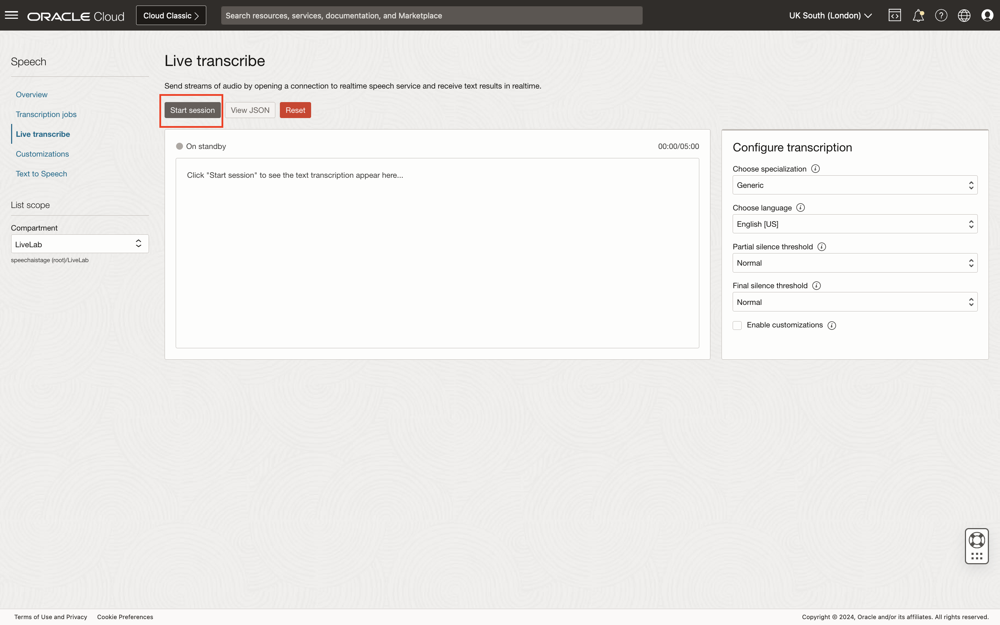
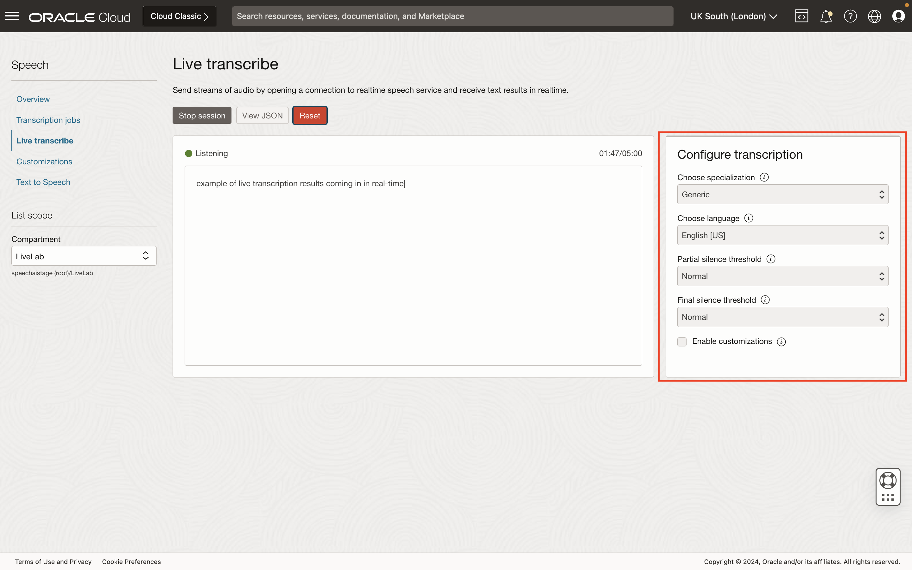

# Lab 2: Transcribe live audio with the console and SDK

## Introduction
In this session, we will help users get familiar with OCI Speech live transcribe and teach them how to use our services via the cloud console.

***Estimated Lab Time***: 5 minutes

### Objectives

In this lab, you will:
- Learn how to transcribe live audio to text from the OCI Console
- Invoke custom vocabulary (customizations) in the OCI Console

### Prerequisites:
- A Free tier or paid tenancy account in OCI (Oracle Cloud Infrastructure)
- Tenancy is whitelisted to be able to use OCI Speech

## Task 1: Navigate to Overview Page

Log into OCI Cloud Console. Using the Burger Menu on the top left corner, navigate to Analytics and AI menu and click it, and then select Language item under AI services.
    

This will navigate you to the transcription jobs overview page.
On the left you can toggle between overview and transcription jobs listing page.
Under documentation you can find helpful links relevant to OCI speech service
    


## Task 2: Open live transcribe and transcribe audio

1. Click "Live transcribe" in the side menu
        

2. Start session

    Click the "Start session" button to open a live transcription session and begin speaking.
            

3. View transcription results in real time

    You can view partial and complete transcription results in the results window below.
        


## Task 3: Changing transcription parameters

To change transcription parameters, look to the <strong>Configure transcription</strong> menu to the right

1. Configure transcription

    Here you can change parameters such as transcription model type, audio language, partial and final silence thresholds
    and enable customizations
        

    <strong>Choose specialization:</strong> Use this parameter to configure the transcription model for specialized audio, e.g. audio that features specific medial terminology
    
    <strong>Choose language:</strong> Use this parameter to configure the language of the speaker
    
    <strong>Partial silence threshold:</strong> Use this parameter to configure how quickly partial results should be 
    returned
    
    <strong>Final silence threshold:</strong> Use this parameter to configure how long to wait before a partial result is finalized 
    
    <strong>Enable customizations:</strong> Check this box to choose a customization to use during your transcription session

## Task 4: Enabling a customization

First, either ensure there is an active customization in your compartment, or create one. Please refer to Lab 3 for guidance

Next, select the <strong>Enable customizations</strong> box in the "Configure transcriptions" menu on the right to select a customization to include in your transcription session.
    

Specify a compartment and select a customization to include in your next transcription session


## Task 5: Using OCI AI Speech live transcription SDK

First, refer to lab 4 (Access OCI speech with OCI SDKs (Optional)) for API signing key and config file setup

OCI AI Speech live transcription uses websockets to relay audio data and receive text transcriptions in real time. This means your client must implement some key listener functions:

<strong>Python example:</strong>
```
on_result(result)
    // This function will be called whenever a result is returned from the 
    // realtime speech transcription service

on_ack_message(ack_message)
    // This function will be called whenever an audio chunk is received 
    // to acknowledge that is has reached the realtime speech service 
    // (when the is_ack_enabled parameter is set to true)

on_connect()
    // This function will be called upon connecting to the realtime speech
    // transcription service

on_connect_message(connect_message)
    // This function is called upon authentication after having initially connected

on_network_event(message)
    // This function is called when a network event is sent by the realtime
    // speech transcription service

on_error(error)
    // This function is called when an error occurs in the realtime speech
    // transcription service. The error message and code will be passed in the error param

on_close(error_code, error_message) (optional)
    // This function is called when connection to the realtime speech transcription
    // service has been closed due to an error, along with the error code and message. 
    // Its implementation is not required
```

Example implementation of listener functions:
```
class MyRealtimeListener(RealtimeClientListener):
    result = []
    transcriptions = []
    ackmessage = None
    connectmessage = {}
    errormessage = {}
    test_name = ""
    client_parameters = None

    def on_result(self, result):
        if result["transcriptions"][0]["isFinal"]:
            logging.info(
                f"Received final results: {result['transcriptions'][0]['transcription']}"
            )
        else:
            logging.info(
                f"Received partial results: {result['transcriptions'][0]['transcription']}"
            )   

        self.result.append(result)
        self.transcriptions.append(result["transcriptions"][0]["transcription"])
        return self.result

    def on_ack_message(self, ackmessage):
        self.ackmessage = ackmessage
        # print(ackmessage)
        return ackmessage

    def on_connect(self):
        logging.info("Connected successfully, pending authentication")
        return "Connected successfully, pending authentication"

    def on_connect_message(self, connectmessage):
        logging.info(f"Authenticated successfully: {connectmessage}")
        self.connectmessage = connectmessage
        return connectmessage

    def on_network_event(self, ackmessage):
        print(f"Network event received: {ackmessage}")
        return ackmessage

    def on_error(self, errormessage):
        logging.error(f"Error: {errormessage}")
        self.errormessage = (errormessage.code, errormessage.reason)
        return errormessage

    def on_close(self, error_code, error_message):
        logging.error(f"Error: {error_message}")
        self.errormessage = (error_code, error_message)
        return self.errormessage
```

<strong>Realtime client parameters</strong> can be set and included in your realtime client to change the behavior of your transcription session. Click [here](https://docs.oracle.com/en-us/iaas/Content/speech/using/using-live-transcribe.htm) for documentation regarding the live transcribe API.

*example values:*

`language_code` : <strong>"en-US"</strong>

`model_domain` : <strong>"MEDICAL"</strong>

`partial_silence_threshold_in_ms` : <strong>500</strong>

`final_silence_threshold_in_ms` : <strong>2000</strong>

`encoding` : <strong>"audio/raw;rate=16000"</strong>

`should_ignore_invalid_customizations` : <strong>True</strong>

`stabilize_partial_results` : <strong>True</strong>

`customizations` : <strong>[Customization1]</strong>

<strong>Example of setting realtime parameters</strong>

```
realtime_speech_parameters: RealtimeParameters = RealtimeParameters()
realtime_speech_parameters.language_code = "en-US"
realtime_speech_parameters.model_domain = (
    realtime_speech_parameters.MODEL_DOMAIN_GENERIC
)
realtime_speech_parameters.partial_silence_threshold_in_ms = 0
realtime_speech_parameters.final_silence_threshold_in_ms = 2000
realtime_speech_parameters.encoding="audio/raw;rate=16000"
realtime_speech_parameters.should_ignore_invalid_customizations = False
realtime_speech_parameters.stabilize_partial_results = (
    realtime_speech_parameters.STABILIZE_PARTIAL_RESULTS_NONE
)
realtime_speech_parameters.customizations = [
    {
        "compartmentId": "ocid1.compartment.....",
        "customizationId": "ocid1.aispeechcustomization....",
        "entities": [
            {
                "entityType": "entityType",
                "customizationAlias": "entityAlias",
                "customizationId": "ocid1.aispeechcustomization.....",
            },
            ...,
        ],
    }
]
```

Download a fully implemented python example [here.](./files/realtime_example.py)
## Acknowledgements
* **Authors**
    * Alex Ginella  - Oracle AI Services